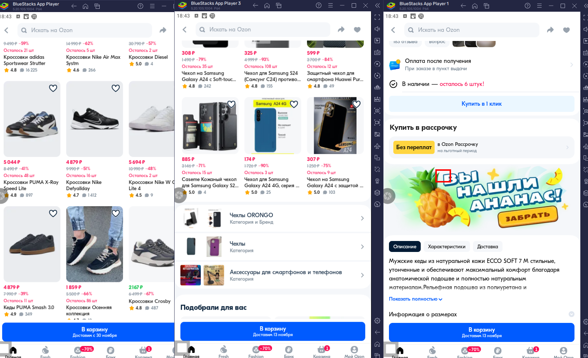

# ozon_clicker

Позволяет добывать ананасы в Ozon app.

# Требования

1. Эмулятор с вертикальной ориентацией, 540x960;
2. Программа AnkuLua 8.3.0 Pro;
3. С помощью программы Screen+Master сделать png снимок ярлыка Ozon на рабочем столе (100% качество);
4. Заменить ozon.png на новый в папке images.

# Пример работы 

